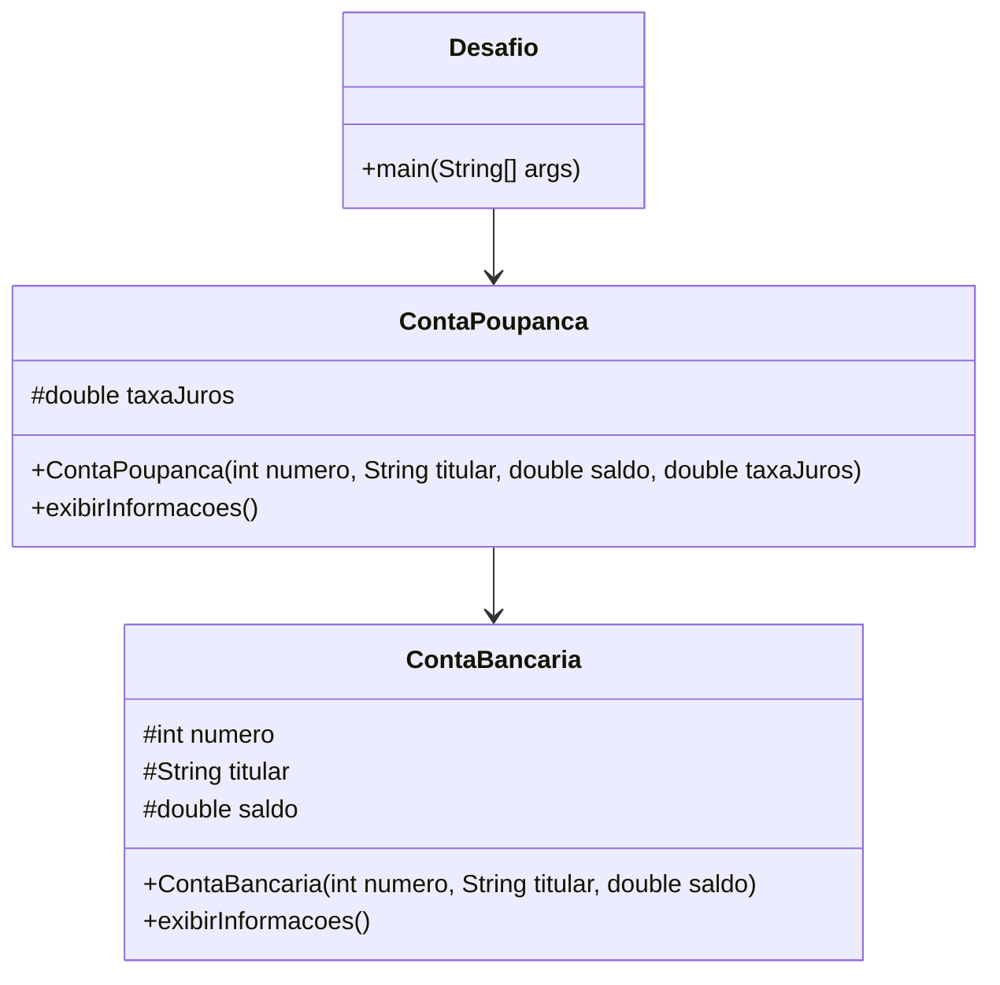

# ContaBancoPoo.

#**Diagrama de Classes**

```mermaid
classDiagram
    class Desafio {
        +main(String[] args)
    }

    class ContaBancaria {
        #int numero
        #String titular
        #double saldo
        +ContaBancaria(int numero, String titular, double saldo)
        +exibirInformacoes()
    }

    class ContaPoupanca {
        #double taxaJuros
        +ContaPoupanca(int numero, String titular, double saldo, double taxaJuros)
        +exibirInformacoes()
    }

    Desafio --> ContaPoupanca
    ContaPoupanca --> ContaBancaria

```
